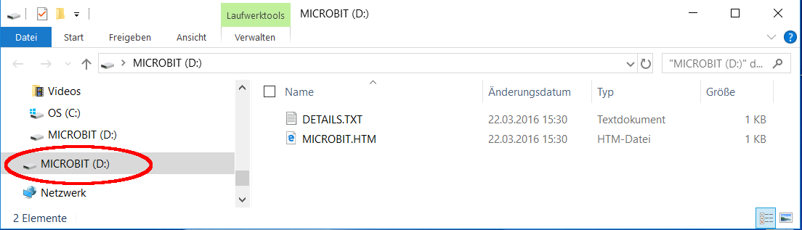
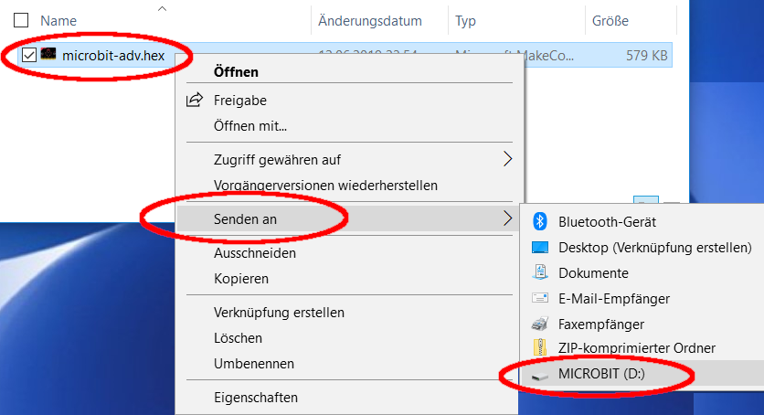

# Softdevice auf dem Micro:bit installieren (Windows 10)

Damit der micro:bit mit der Arduino-IDE programmiert werden kann, muss ein "Softdevice"-Radio auf dem micro:bit installiert sein. Wenn der micro:bit mit MicroPython verwendet wurde, wurde dieses Softdevice gelöscht.  
Das erneute Installieren ist ganz einfach. Laden Sie die microbit-adv.hex Datei herunter und ziehen Sie es auf Ihr MICROBIT-Laufwerk, um ein MakeCode-Bluetooth-Werbebeispiel zu installieren.

1. Download der Datei [microbit-adv.hex](microbit-adv.hex) _(Rechtsklick - >Ziel speichern unter<)_
1. Den **micro:bit** am USB-Port des Computers anschliessen.  
    
    - _Der `MAINTENANCE-Modus` ist **nicht erforderlich!**_
1.  Wechsel zum (Download-)Ordner mit der Datei microbit-adv.hex und  
mit einem _Rechtsklick_ auf die Datei mit 'SENDEN AN' Laufwerk: `MICROBIT (D:\)` die Hex-Datei installieren.  

Alternativ die Hex-Datei in das Laufwerk: `MICROBIT (D:\)` kopieren.
1. Nun kann mit der Arduino-IDE der micro:bit mit C programmiert werden.
